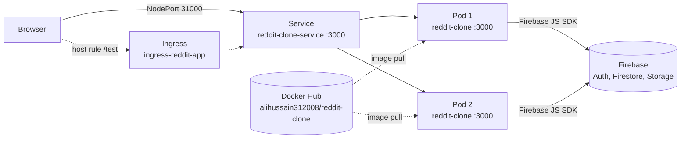

# Reddit Clone on Kubernetes

A Next.js + Firebase Reddit clone, packaged as a container image and run on Kubernetes as a 2-replica Deployment exposed through a NodePort Service, with an optional Ingress.

## Architecture



The Next.js app talks to Firebase directly from the browser; Kubernetes only runs and exposes the web tier.

## Stack

| Layer | Tech |
|---|---|
| App | Next.js 13, React 18, Chakra UI, Recoil, TypeScript |
| Backend services | Firebase Auth, Firestore, Storage, Cloud Functions (`functions/`) |
| Orchestration | Kubernetes: Deployment, Service (NodePort), Ingress |
| Packaging | Multi-stage Dockerfile (Node 18 Alpine) |
| CI | GitHub Actions: ESLint, `tsc`, Docker build + hadolint, kubeconform, Trivy |

## Quick start

Prerequisites: Docker, `kubectl`, and a cluster (Minikube, kind or your own).

```bash
git clone https://github.com/frenzyali/reddit-clone-k8s.git
cd reddit-clone-k8s
```

**Option A: use the pre-built image** (`alihussain312008/reddit-clone`, referenced in `Deployment.yaml`).

**Option B: build your own image** with your Firebase web-app config (see `.env.example` for the keys), push it, and point `Deployment.yaml` at it:

```bash
docker build -t <you>/reddit-clone:1.0 \
  --build-arg NEXT_PUBLIC_FIREBASE_API_KEY=... \
  --build-arg NEXT_PUBLIC_FIREBASE_AUTH_DOMAIN=... \
  --build-arg NEXT_PUBLIC_FIREBASE_PROJECT_ID=... \
  --build-arg NEXT_PUBLIC_FIREBASE_STORAGE_BUCKET=... \
  --build-arg NEXT_PUBLIC_FIREBASE_MESSAGING_SENDER_ID=... \
  --build-arg NEXT_PUBLIC_FIREBASE_APP_ID=... .
docker push <you>/reddit-clone:1.0
```

Then deploy:

```bash
kubectl apply -f Deployment.yaml -f service.yaml
kubectl get pods -l app=reddit-clone        # wait for both pods to be Running

# Minikube:
minikube service reddit-clone-service --url
# any cluster:
kubectl port-forward service/reddit-clone-service 3000:3000   # http://localhost:3000
```

`ingress.yaml` is a template: replace `domain.com` and the `/test` path, and make sure an ingress controller is installed, before applying it.

### Running the app without Kubernetes

```bash
cp .env.example .env.local     # fill in your Firebase web-app config values
npm ci
npm run dev                    # http://localhost:3000
```

## Design decisions

- **Stateless web tier.** All state lives in Firebase, so replicas are interchangeable and `replicas: 2` is safe without volumes.
- **Config at build time.** Firebase settings are `NEXT_PUBLIC_*` variables that Next.js inlines into the JavaScript bundle, so they must be supplied when the image is built. They are public client identifiers; access control is enforced by Firebase security rules, not by hiding them.
- **Health probes and limits.** The Deployment has readiness/liveness probes on `/` and CPU/memory requests and limits, so traffic only reaches ready pods and a runaway pod can't starve the node.
- **NodePort first, Ingress optional.** A fixed `nodePort: 31000` works on any bare cluster or EC2 host without a load balancer; the Ingress shows host-based routing once a controller exists.
- **Manifests validated in CI.** kubeconform checks each manifest against the Kubernetes schemas on every push, so broken YAML is caught before `kubectl apply`.

## Known limitations

- `Deployment.yaml` uses the untagged (`latest`) image. Pin a version tag once you publish one.
- `ingress.yaml` contains placeholder hosts (`domain.com`) and a `/test` path; edit them before applying.
- `.npmrc` sets `legacy-peer-deps=true` because Chakra UI 1.x expects framer-motion 6 or older while the app uses 8.
- Firebase settings are baked into the image at build time, so each environment needs its own image build.

## Cleanup

```bash
kubectl delete -f service.yaml -f Deployment.yaml
kubectl delete -f ingress.yaml          # only if you applied it
minikube delete                         # if you used Minikube
```
